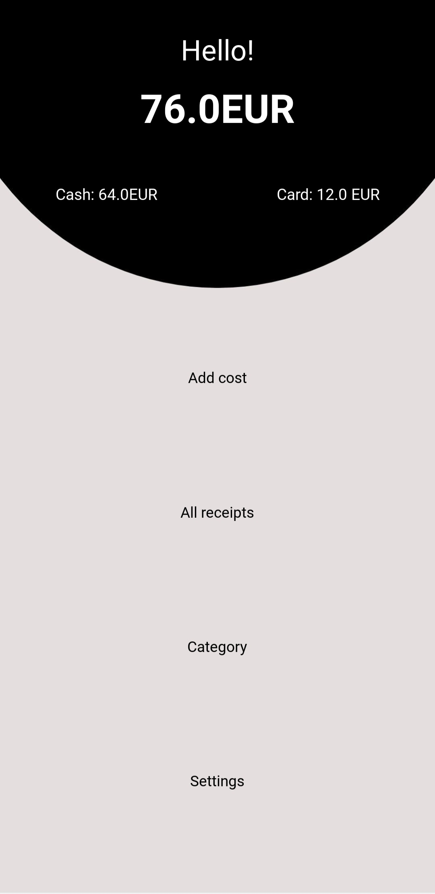
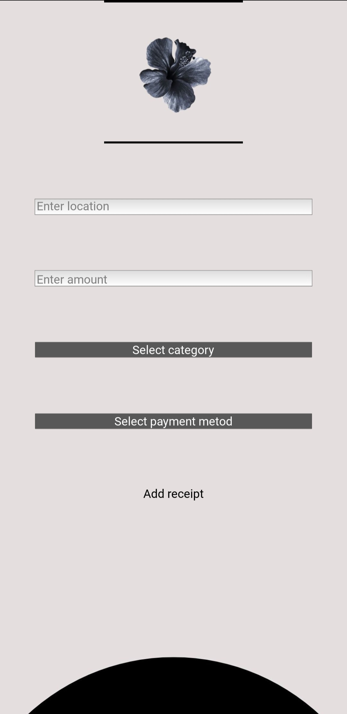
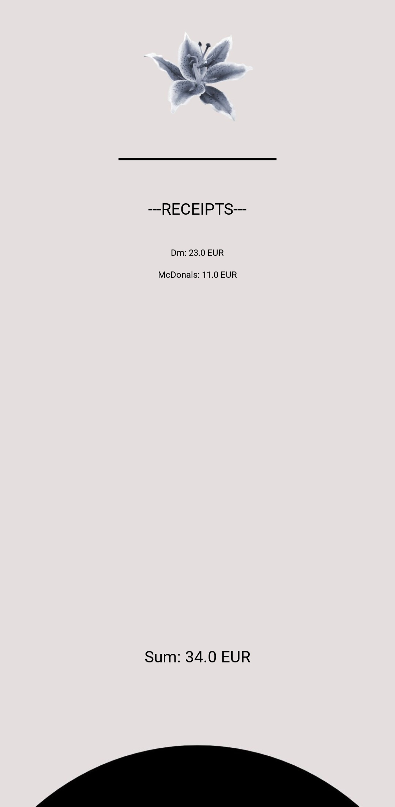
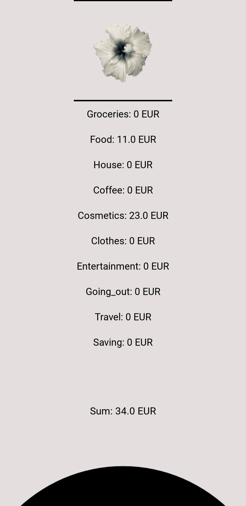
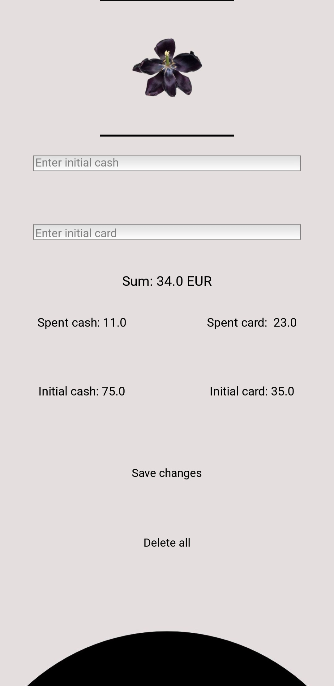

# Budgeting App

A simple mobile budgeting application for personal finance tracking, built with Python and the Kivy framework.

---

## Features
- Add expenses (amount, date, category)
- Track spending by category (food, transport, entertainment, etc.)
- View all recorded expenses
- Check available balance in real time

---

## Technologies

- Python 3
- Kivy Framework
- JSON 

---

## Applied Skills

- Mobile UI development with Kivy
- Data handling 
- Python application architecture

---

## Installation
*Android only*

1. Download the `.apk` file from the **apk** folder  
2. Transfer the file to your Android phone  
3. Open the file and follow the installation prompts  

---

## Screenshots

 

